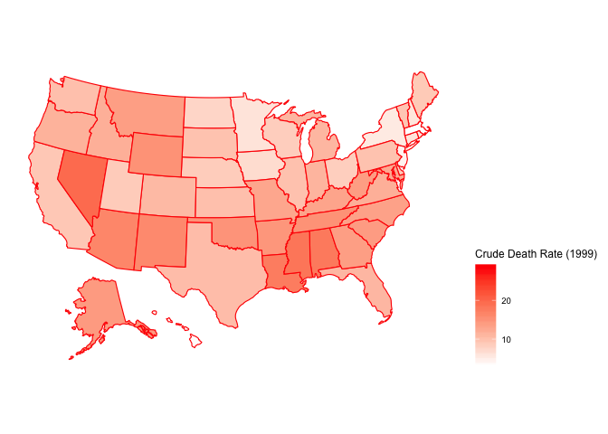
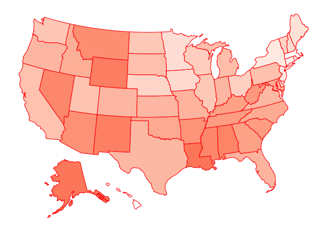
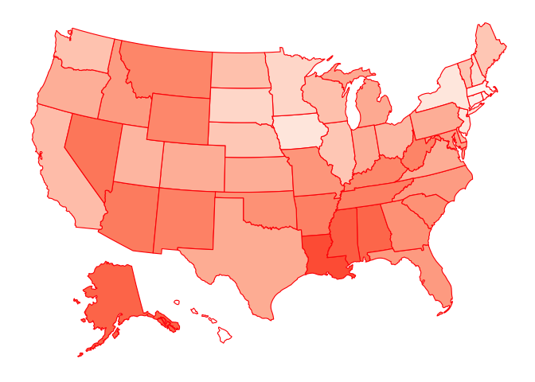
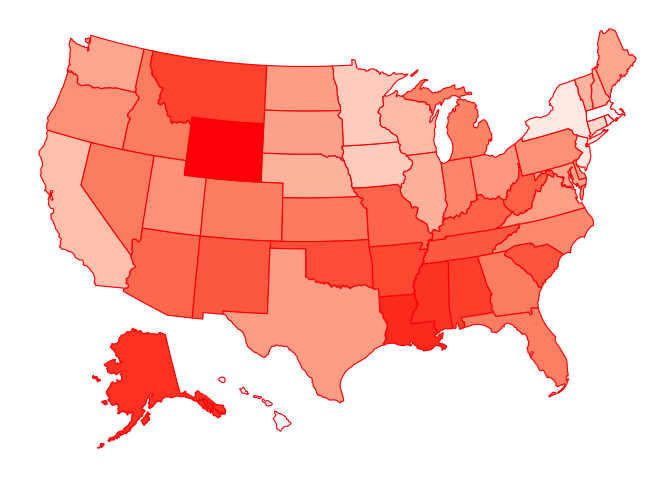
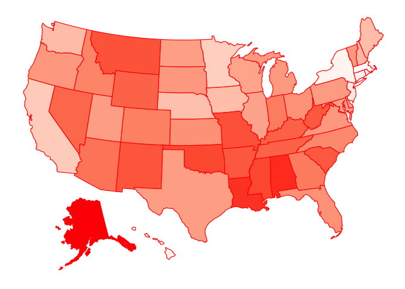
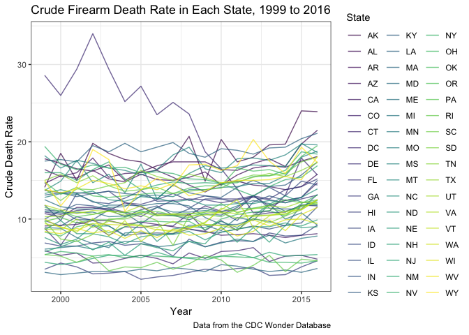
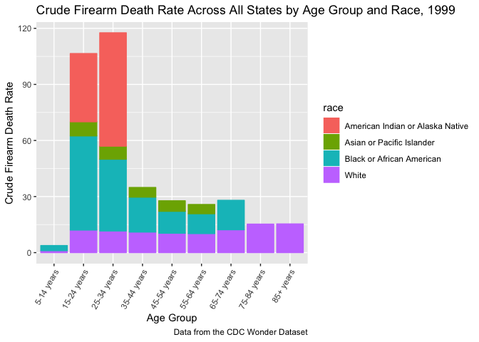
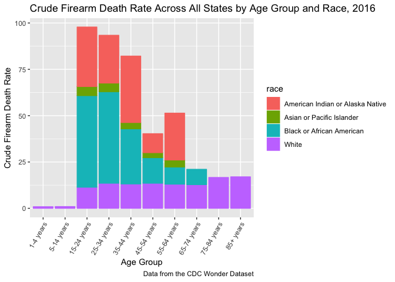

Firearm Mortality\_devon
================
Devon Morgan
11/13/2018

Import and Tidy Firearm Mortality Data
--------------------------------------

Imported firearm mortality datasets from CDC Wonder database.

``` r
# Detailed Firearm Mortality Datatsets by Race, Age
firearm_mortality = read_csv("./data/cdc_firearm_mortality_data.csv", na = "Unreliable") %>% 
    janitor::clean_names() %>% 
    select(-ten_year_age_groups_code, -injury_mechanism_all_other_leading_causes_code, -race_code, death_cause= injury_mechanism_all_other_leading_causes) %>% 
    mutate(ten_year_age_groups = factor(ten_year_age_groups, levels = c("1-4 years", "5-14 years", "15-24 years", "25-34 years", "35-44 years", "45-54 years", "55-64 years", "65-74 years", "75-84 years", "85+ years")))

# Summary Firearm Mortality Dataset by Year
firearm_mortality_summary = read_excel("./data/cdc_firearm_all_ages.xlsx") %>% 
    janitor::clean_names() %>% 
    select(-year_code, -injury_mechanism_all_other_leading_causes_code, death_cause= injury_mechanism_all_other_leading_causes)
```

Added state abbreviations to Summary Firearm Mortality dataset:

``` r
# Created table with state name and state abbreviations crosswalk
st_crosswalk = tibble(state = state.name) %>%
   bind_cols(tibble(abb = state.abb)) %>% 
     bind_rows(tibble(state = "District of Columbia", abb = "DC"))

# Joined abbreviation dataset with summary firearm mortality dataset
clean_firearm_mortality = left_join(firearm_mortality_summary, st_crosswalk, by = "state") %>% 
    rename(state_abb = abb)
```

Import and Tidy Law Grade Dataset
---------------------------------

``` r
# website URL
url = "https://lawcenter.giffords.org/scorecard/#rankings"
gun_climate_url = read_html(url)

# extract table and clean data
gun_climate_data = 
    gun_climate_url %>% 
  html_nodes(css = "table") %>% 
  .[[1]] %>% 
  html_table(header = TRUE) %>% 
  as.tibble() %>% 
    janitor::clean_names() %>% 
    rename(
        law_strength = gun_law_strength_ranked, 
        grade_2017 = x2017grade, 
        death_rate_rank = gun_death_rate_ranked, 
        death_rate = gun_death_rate_per_100k) %>% 
    mutate(
    grade_2017 = factor(grade_2017, 
                      levels = c("A", "A-", "B+", "B", "C+", "C", "C-", "D", "D-", "F")), 
    grade_2017 = fct_collapse(grade_2017, 
                                                        A = c("A", "A-"), 
                                                        B = c("B+", "B"), 
                                                        C = c("C+", "C", "C-"), 
                                                        D = c("D", "D-")), 
    state_abb = state.abb) %>% 
        select(-state, -death_rate_rank, -death_rate)
```

Merge Law Grade Dataset with Summary Firearm Mortality Dataset
--------------------------------------------------------------

``` r
merged_firearm_mortality = left_join(clean_firearm_mortality, gun_climate_data, by = "state_abb")
```

Map of Crude Death Rates in 1999, 2007, 2012, 2016
--------------------------------------------------



Spaghetti Plot of Crude Firearm Death Rate, by State, 1999-2016
---------------------------------------------------------------

``` r
merged_firearm_mortality %>% 
  ggplot(aes(x = year, y = crude_rate, color = state_abb)) + 
  geom_line(alpha = 0.7, size = 0.5) +
  labs(
    title = "Crude Firearm Death Rate in Each State, 1999 to 2016",
    x = "Year",
    y = "Crude Death Rate",
    caption = "Data from the CDC Wonder Database"
  ) + 
  theme_bw() + 
    viridis::scale_color_viridis(discrete = TRUE,
                               name = "State")
```



Crude Firearm Death Rate by Age Group and Race, 1999, 2016
----------------------------------------------------------

``` r
firearm_mortality %>% 
    filter(year == 1999) %>% 
    group_by(ten_year_age_groups, race) %>%
    summarize(n_deaths = sum(deaths),
                        n_population = sum(population)) %>% 
    mutate(crude_rate = (n_deaths/n_population)*100000) %>% 
    ggplot(aes(fill= race, x = ten_year_age_groups, y = crude_rate, color = race)) +
    geom_bar(stat = "identity") +
    theme(axis.text.x = element_text(angle=60, hjust=1)) + 
    labs(
    title = "Crude Firearm Death Rate Across All States by Age Group and Race, 1999",
    x = "Age Group",
    y = "Crude Firearm Death Rate",
    caption = "Data from the CDC Wonder Dataset")
```



``` r
firearm_mortality %>% 
    filter(year == 2016) %>% 
    group_by(ten_year_age_groups, race) %>%
    summarize(n_deaths = sum(deaths),
                        n_population = sum(population)) %>% 
    mutate(crude_rate = (n_deaths/n_population)*100000) %>% 
    ggplot(aes(fill= race, x = ten_year_age_groups, y = crude_rate, color = race)) +
    geom_bar(stat = "identity") +
    theme(axis.text.x = element_text(angle=60, hjust=1)) + 
    labs(
    title = "Crude Firearm Death Rate Across All States by Age Group and Race, 2016",
    x = "Age Group",
    y = "Crude Firearm Death Rate",
    caption = "Data from the CDC Wonder Dataset")
```


