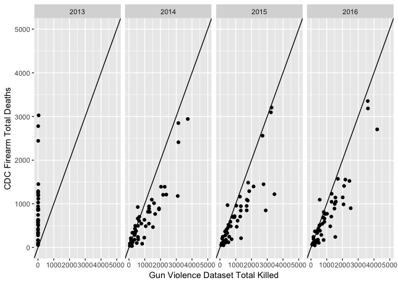

Gun Violence Data
================
Zanis Fang, UID: ZF2213
11/25/2018

``` r
library(tidyverse)
```

    ## ── Attaching packages ────────────────────────────────────────────────── tidyverse 1.2.1 ──

    ## ✔ ggplot2 3.0.0.9000     ✔ purrr   0.2.5     
    ## ✔ tibble  1.4.2          ✔ dplyr   0.7.6     
    ## ✔ tidyr   0.8.1          ✔ stringr 1.3.1     
    ## ✔ readr   1.1.1          ✔ forcats 0.3.0

    ## ── Conflicts ───────────────────────────────────────────────────── tidyverse_conflicts() ──
    ## ✖ dplyr::filter() masks stats::filter()
    ## ✖ dplyr::lag()    masks stats::lag()

``` r
gun_violence <- read_csv(list.files("./dataset", full.names = TRUE)[2])
```

    ## Parsed with column specification:
    ## cols(
    ##   .default = col_character(),
    ##   incident_id = col_integer(),
    ##   date = col_date(format = ""),
    ##   n_killed = col_integer(),
    ##   n_injured = col_integer(),
    ##   congressional_district = col_integer(),
    ##   latitude = col_double(),
    ##   longitude = col_double(),
    ##   n_guns_involved = col_integer(),
    ##   state_house_district = col_integer(),
    ##   state_senate_district = col_integer()
    ## )

    ## See spec(...) for full column specifications.

``` r
state_abb <- state.abb
names(state_abb) <- state.name

gun_violence_tidy <- gun_violence %>% 
    select(date, state, latitude, longitude, n_killed, n_injured) %>% 
    mutate(year = lubridate::year(date)) %>% 
    mutate(state = state_abb[state],
                 state = ifelse(is.na(state), "DC", state)) %>% 
    select(-date)
    

# write_csv(x = gun_violence_tidy, path = "./shiny_dataset/gun_violence_tidy.csv")
```

``` r
library(tidyverse)

# fixed width dataframe

merged_firearm_mortality <-
    read_csv("./shiny_dataset/merged_firearm_mortality.csv") %>%
    select(state_abb, year, crude_rate, deaths, population, law_strength) %>%
    rename(state = state_abb) %>% 
    unite(col = state_year, state, year, sep = "_")
```

    ## Parsed with column specification:
    ## cols(
    ##   state = col_character(),
    ##   state_code = col_integer(),
    ##   year = col_double(),
    ##   death_cause = col_character(),
    ##   deaths = col_integer(),
    ##   population = col_double(),
    ##   crude_rate = col_double(),
    ##   state_abb = col_character(),
    ##   law_strength = col_integer(),
    ##   grade_2017 = col_character()
    ## )

``` r
gun_violence <- read_csv("./shiny_dataset/gun_violence_tidy.csv") %>% 
    sample_n(size = 25000)
```

    ## Parsed with column specification:
    ## cols(
    ##   state = col_character(),
    ##   latitude = col_double(),
    ##   longitude = col_double(),
    ##   n_killed = col_integer(),
    ##   n_injured = col_integer(),
    ##   year = col_integer()
    ## )

``` r
gun_violence_merged <- read_csv("./shiny_dataset/gun_violence_tidy.csv") %>%
    group_by(state, year) %>%
    summarize(total_killed = n(), total_injured = n()) %>% 
    unite(col = state_year, state, year, sep = "_")
```

    ## Parsed with column specification:
    ## cols(
    ##   state = col_character(),
    ##   latitude = col_double(),
    ##   longitude = col_double(),
    ##   n_killed = col_integer(),
    ##   n_injured = col_integer(),
    ##   year = col_integer()
    ## )

``` r
unempl <- read_csv("./shiny_dataset/unempl.csv") %>% 
    unite(col = state_year, state, year, sep = "_")
```

    ## Parsed with column specification:
    ## cols(
    ##   state = col_character(),
    ##   year = col_double(),
    ##   unemployment_rate = col_double()
    ## )

``` r
merged_data <- full_join(x = gun_violence_merged, y = unempl, by = "state_year")
merged_data <- full_join(x = merged_data, y = merged_firearm_mortality, by = "state_year")
merged_data_wide <- merged_data %>% 
    separate(col = state_year, into = c("state", "year"), sep = "_")

merged_data <- merged_data_wide %>% 
    gather(key = type_variable, value = value, total_killed:law_strength) %>% 
    mutate(year = as.numeric(year)) %>% 
    arrange(year)

merged_data_wide %>%
    # filter(total_killed != 0 & deaths != 0) %>% 
    filter(year <= 2016, year >= 2013) %>% 
    ggplot(aes(x = total_killed, y = deaths)) +
      geom_point() +
      scale_x_continuous(limits = c(-1, 5000)) +
      scale_y_continuous(limits = c(-1, 5000)) +
      geom_abline(slope = 1, intercept = 0) +
      facet_grid(. ~ year) +
      labs(
        x = "Gun Violence Dataset Total Killed",
        y = "CDC Firearm Total Deaths"
      )
```

    ## Warning: Removed 19 rows containing missing values (geom_point).

<!-- -->

*Comments:*

1.  Note that both datasets have 2014 to 2016 data, but CDC dataset has
    1999 to 2013 data.
2.  For 2014 to 2016, CDC data seems to be a subset of Gun Violence
    dataset.
