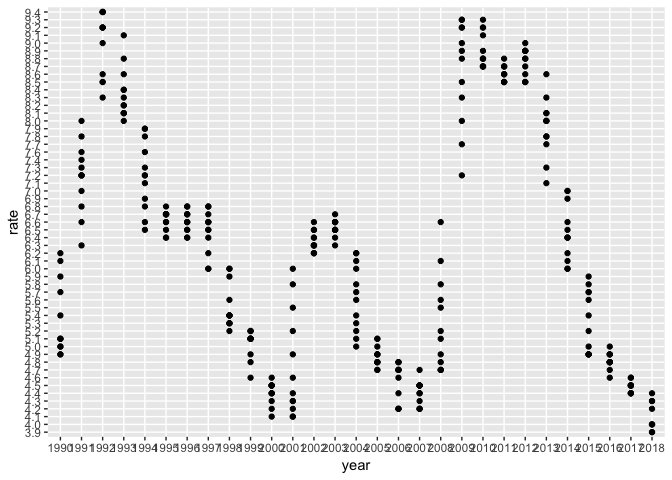

Socioeconomic status
================
Zanis Fang, UID: ZF2213
11/14/2018

``` r
# download the file if not exist
if (!file.exists("./dataset/ssamatab1.txt")) {
    download.file("https://www.bls.gov/web/metro/ssamatab1.txt",
                                destfile = "./dataset/ssamatab1.txt")
}
    
# get file name
ssamatab1_file <- "./dataset/ssamatab1.txt"

# get colname rows
ssamatab1_colname <- read_lines(ssamatab1_file, skip = 3, n_max = 1)
# parse column name, words linked by single space, if not, words without space
ssamatab1_colname <-
    str_extract_all(ssamatab1_colname, "([\\S]+[\\s][\\S]+)|[\\S]+") %>%
    unlist()

####### not important here
# play with metacharacters
ssamatab1_sample <- read_lines(ssamatab1_file, skip = 5, n_max = 3)
# start with M or one space, followed by non-space, followed by one space, non-overlapping
str_extract_all(ssamatab1_sample, "[M|\\s]\\S+[\\s]")
```

    ## [[1]]
    ##  [1] "MT0111500000000 "                " 01 "                           
    ##  [3] " 11500 "                         " Anniston-Oxford-Jacksonville, "
    ##  [5] " MSA "                           " 1990 "                         
    ##  [7] " 01 "                            " 51,485 "                       
    ##  [9] " 48,307 "                        " 3,178 "                        
    ## 
    ## [[2]]
    ##  [1] "MT0112220000000 "  " 01 "              " 12220 "          
    ##  [4] " Auburn-Opelika, " " MSA "             " 1990 "           
    ##  [7] " 01 "              " 44,415 "          " 41,247 "         
    ## [10] " 3,168 "          
    ## 
    ## [[3]]
    ##  [1] "MT0113820000000 "     " 01 "                 " 13820 "             
    ##  [4] " Birmingham-Hoover, " " MSA "                " 1990 "              
    ##  [7] " 01 "                 " 457,612 "            " 433,590 "           
    ## [10] " 24,022 "

``` r
# start with non-space, end with one space, non-overlapping
str_extract_all(ssamatab1_sample, "[\\S]+\\s")
```

    ## [[1]]
    ##  [1] "MT0111500000000 "               "01 "                           
    ##  [3] "11500 "                         "Anniston-Oxford-Jacksonville, "
    ##  [5] "AL "                            "MSA "                          
    ##  [7] "1990 "                          "01 "                           
    ##  [9] "51,485 "                        "48,307 "                       
    ## [11] "3,178 "                        
    ## 
    ## [[2]]
    ##  [1] "MT0112220000000 " "01 "              "12220 "          
    ##  [4] "Auburn-Opelika, " "AL "              "MSA "            
    ##  [7] "1990 "            "01 "              "44,415 "         
    ## [10] "41,247 "          "3,168 "          
    ## 
    ## [[3]]
    ##  [1] "MT0113820000000 "    "01 "                 "13820 "             
    ##  [4] "Birmingham-Hoover, " "AL "                 "MSA "               
    ##  [7] "1990 "               "01 "                 "457,612 "           
    ## [10] "433,590 "            "24,022 "

``` r
# one word character (number or letter), one non-word character(others)
str_extract_all(ssamatab1_sample, "\\w\\W")
```

    ## [[1]]
    ##  [1] "0 " "1 " "0 " "n-" "d-" "e," "L " "A " "0 " "1 " "1," "5 " "8," "7 "
    ## [15] "3," "8 " "6."
    ## 
    ## [[2]]
    ##  [1] "0 " "1 " "0 " "n-" "a," "L " "A " "0 " "1 " "4," "5 " "1," "7 " "3,"
    ## [15] "8 " "7."
    ## 
    ## [[3]]
    ##  [1] "0 " "1 " "0 " "m-" "r," "L " "A " "0 " "1 " "7," "2 " "3," "0 " "4,"
    ## [15] "2 " "5."

``` r
# start with any number of non-space, end with a single space or the end of line, such pattern goes over and over until meet two consecutive spaces 
str_extract_all(ssamatab1_sample, "([\\S]+[\\s|$[0-9]])+")
```

    ## [[1]]
    ##  [1] "MT0111500000000 "                     
    ##  [2] "01 "                                  
    ##  [3] "11500 "                               
    ##  [4] "Anniston-Oxford-Jacksonville, AL MSA "
    ##  [5] "1990 "                                
    ##  [6] "01 "                                  
    ##  [7] "51,485 "                              
    ##  [8] "48,307 "                              
    ##  [9] "3,178 "                               
    ## [10] "6.2"                                  
    ## 
    ## [[2]]
    ##  [1] "MT0112220000000 "        "01 "                    
    ##  [3] "12220 "                  "Auburn-Opelika, AL MSA "
    ##  [5] "1990 "                   "01 "                    
    ##  [7] "44,415 "                 "41,247 "                
    ##  [9] "3,168 "                  "7.1"                    
    ## 
    ## [[3]]
    ##  [1] "MT0113820000000 "           "01 "                       
    ##  [3] "13820 "                     "Birmingham-Hoover, AL MSA "
    ##  [5] "1990 "                      "01 "                       
    ##  [7] "457,612 "                   "433,590 "                  
    ##  [9] "24,022 "                    "5.2"

``` r
######

# fixed width dataframe
ssamatab1 <- read_delim("./dataset/ssamatab1.txt",
                                                delim = "[ ]",
                                                col_names = "raw",
                                                skip = 5) %>%
    filter(str_detect(raw, "MT[0-9]+[\\s]")) %>%
    separate(raw, into = ssamatab1_colname, sep = "[\\s]{2,}") %>% 
    janitor::clean_names()
```

    ## Parsed with column specification:
    ## cols(
    ##   raw = col_character()
    ## )

``` r
# take a look at unemployment rate of New York-Newark_Jersey area
ssamatab1 %>%
    filter(str_detect(area, "New York")) %>%
    ggplot(aes(y = rate, x = year)) +
      geom_point()
```

<!-- -->
